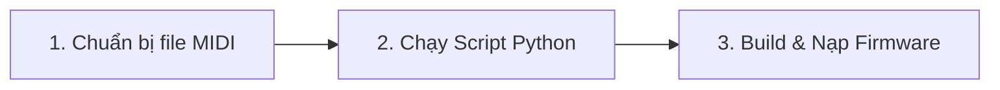

# 🎵 Hướng Dẫn Từng Bước: Cách Thêm Bài Hát Mới Vào Hệ Thống Stepper Music

Tài liệu này hướng dẫn chi tiết từng bước để bạn tự chuyển đổi một file nhạc MIDI bất kỳ và tích hợp thành công vào hệ thống phát nhạc bằng động cơ bước (3 kênh âm thanh) trên board **STM32F411E-DISCO**.

---

## 🛠️ Quy Trình Tổng Quan

Nhờ có bộ script Python tự động hóa, quy trình thêm bài hát cực kỳ đơn giản và bao gồm 3 bước chính sau:



---

## 📝 Các Bước Thực Hiện Chi Tiết

### 📂 Bước 1: Chuẩn bị File MIDI (`.mid`)
* Chuẩn bị file MIDI của bài hát bạn muốn thêm (định dạng `.mid`).
* **Khuyến nghị:** Chọn các file MIDI có cấu trúc đa âm (polyphonic) rõ ràng, lý tưởng nhất là có ít nhất 3 bè (Melody, Harmony, Bass) để thuật toán phân tách kênh của script hoạt động đạt hiệu quả âm thanh tốt nhất.
* Đặt file MIDI vào thư mục gốc của dự án hoặc một vị trí dễ truy cập (ví dụ: `C:/MidiFiles/my_song.mid`).

---

### 🐍 Bước 2: Chuyển đổi & Tự động Tích hợp bằng Python
Dự án được trang bị công cụ chuyển đổi thông minh **`midi_to_song_3_player.py`** có khả năng tự động phân tích và chỉnh sửa mã nguồn C (`songs.h`) chỉ với một dòng lệnh duy nhất.

1. Mở Terminal (PowerShell hoặc Command Prompt) tại thư mục gốc của dự án: `d:\step-motor-media-player`.
2. Chạy lệnh chuyển đổi với cú pháp sau:

```bash
python midi_to_song_3_player.py "đường/dẫn/tới/file_nhạc.mid" "Tên Hiển Thị Bài Hát"
```

> [!TIP]
> **Tùy chọn Thời Lượng Nhạc Chính Xác (`--raw`):**
> Theo mặc định, script sẽ ánh xạ thời gian nốt nhạc về các macro nốt tiêu chuẩn (`MS_Q`, `MS_H`, `MS_W`,...). Nếu bài hát có nhịp điệu phức tạp, dồn dập hoặc thay đổi tempo liên tục, hãy thêm tham số `--raw` để xuất thời lượng chính xác bằng mili-giây:
> ```bash
> python midi_to_song_3_player.py "đường/dẫn/tới/file_nhạc.mid" "Tên Hiển Thị Bài Hát" --raw
> ```

#### 🤖 Script tự động thực hiện những gì?
* **Tách bè thông minh (3 kênh):** 
  * **Melody (Kênh 1 - TIM1):** Chọn các nốt nhạc dựa trên khoảng cách cao độ gần nhất với nốt trước đó để giai điệu mượt mà, tránh nhảy quãng xa.
  * **Bass (Kênh 3 - TIM3):** Tự động phát hiện và trích xuất nốt nhạc thấp nhất tại mỗi thời điểm.
  * **Harmony (Kênh 2 - TIM2):** Trích xuất nốt cao nhất còn lại trong hợp âm (không trùng Melody và Bass).
* **Tạo file Header mới:** Tạo ra file `src/songs/tên_bài_hát.h` chứa các mảng nốt nhạc `Step` và kích thước bè tương ứng.
* **Auto-Patching `src/songs.h`:**
  * Tự động thêm dòng `#include "songs/tên_bài_hát.h"` vào đầu file `src/songs.h`.
  * Tự động tạo và chèn phần tử `Song3` tương ứng vào cuối mảng đăng ký bài hát `song_list[]`.

---

### 💻 Bước 3: Cấu hình Thiết Lập Mặc Định (Tùy chọn)

Nếu bạn muốn bài hát mới thêm sẽ tự động phát ngay khi cấp nguồn cho STM32:

1. Mở file [src/main.c](file:///d:/step-motor-media-player/src/main.c).
2. Tìm đến hàm `main(void)` và sửa chỉ số trong hàm `player_play_song()` thành chỉ số của bài hát mới trong danh sách (bài hát cuối cùng thường có chỉ số là `SONG_COUNT - 1` hoặc bạn đếm từ `0` theo thứ tự trong mảng `song_list[]` ở file `src/songs.h`).

```c
int main(void) {
    player_init();
    
    // Thiết lập âm lượng riêng cho từng kênh motor (0 - 100)
    player_set_volume_channel(MOTOR_MELODY, 80);
    player_set_volume_channel(MOTOR_HARMONY, 50);
    player_set_volume_channel(MOTOR_BASS, 40);
    
    // Thay đổi số 0 thành chỉ số bài hát mới của bạn
    player_play_song(4); 
    
    while (1) {}
}
```

> [!NOTE]
> Cho dù bạn không đổi bài hát mặc định phát ban đầu trong `main.c`, bạn vẫn có thể nhấn **nút nhấn PD0** trên board để chuyển qua lại và phát bài hát mới thêm vì nó đã được tự động đăng ký vào danh sách xoay vòng!

---

### 🚀 Bước 4: Biên dịch & Nạp Chương Trình

1. Kết nối board **STM32F411E-DISCO** với máy tính thông qua cáp USB (cắm vào cổng ST-LINK).
2. Sử dụng công cụ PlatformIO trong VS Code:
   * **Build:** Nhấn vào nút hình dấu tích (✓) ở thanh trạng thái bên dưới để biên dịch mã nguồn. Đảm bảo biên dịch thành công không có lỗi.
   * **Upload:** Nhấn vào nút hình mũi tên sang phải (→) để nạp firmware trực tiếp vào vi điều khiển STM32.
3. Sau khi nạp xong, các động cơ bước sẽ lập tức co kéo tạo rung động âm thanh để phát nhạc bài hát đã thiết lập!

---

## ⚠️ Các Lỗi Thường Gặp & Cách Khắc Phục

| Vấn đề | Nguyên nhân | Cách khắc phục |
| :--- | :--- | :--- |
| **Lỗi `ModuleNotFoundError` khi chạy script** | Thiếu thư viện Python hỗ trợ đọc file MIDI (`mido`). | Chạy lệnh `pip install mido` trong Terminal để cài đặt thư viện cần thiết. |
| **Không nghe thấy bè Bass hoặc Harmony** | Bản nhạc MIDI gốc quá đơn giản hoặc chỉ có duy nhất 1 track nhạc. | Tìm bản MIDI khác có nhiều track nhạc hoặc phối khí đầy đủ nhạc cụ hơn để thuật toán tách bè hoạt động chính xác. |
| **Motor bị kêu rè hoặc quay liên tục ở các nốt cao** | Tần số nốt nhạc cao vượt quá giới hạn mô-men xoắn giữ của motor, làm motor bị trượt bước hoặc tự quay. | Chuyển chế độ driver sang microstepping (kết nối M0/M1/M2 lên 3.3V) hoặc hạ tone của bài hát MIDI trước khi chuyển đổi. |
| **Mất nhạc một bè đột ngột** | Trong mảng đăng ký `Song3` bị khai báo thiếu hoặc sai tên mảng nốt. | Mở file [src/songs.h](file:///d:/step-motor-media-player/src/songs.h) và kiểm tra lại cấu trúc phần tử của bài hát trong mảng `song_list[]` xem đã ánh xạ đúng tên biến trong file `.h` chưa. |

---

Chúc bạn có những trải nghiệm âm nhạc cơ khí tuyệt vời với hệ thống Stepper Motor Music! 🎧🔩
