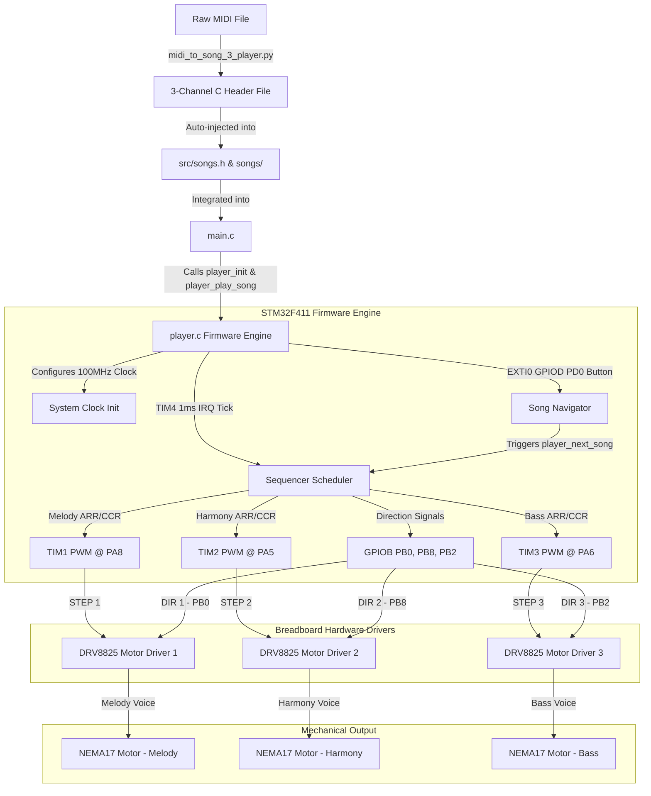

# STM32 Electromechanical Music System — Project Summary

> [!NOTE]
> This document details the architectural specifications, hardware connections, firmware logic, and MIDI converter tools for the **3-Channel Polyphonic Stepper Motor Music System** running on the **STM32F411E-DISCO** board.

---

## 🗺️ System Architecture

The following Mermaid diagram visualizes the flow of data from raw MIDI files to synchronized mechanical sound generation across 3 channels, including user controls (Volume & Button selection):



---

## 🔌 Hardware Configuration & Pinout Mapping

The system utilizes three independent NEMA17 stepper motors as sound sources, where each step pulse commands a mechanical detent movement that translates directly to an audible pitch.

### 📍 Pinout Matrix

| Motor Channel | Function | Timer / Peripheral | PWM STEP Pin (Output) | GPIO DIR Pin (Output) | Hardware Driver Channel |
| :--- | :--- | :--- | :--- | :--- | :--- |
| **Motor 1 (Melody)** | Melody Voice | TIM1_CH1 | **PA8** | **PB0** | DRV8825 Driver #1 |
| **Motor 2 (Harmony)** | Chord Harmony | TIM2_CH1 | **PA5** | **PB8** | DRV8825 Driver #2 |
| **Motor 3 (Bass)** | Bass Line | TIM3_CH1 | **PA6** | **PB2** | DRV8825 Driver #3 |
| **User Control** | Next Song | EXTI0 (GPIOD) | **PD0** (Button Input) | — | Internal User Button |

### 🛠️ DRV8825 Driver Settings
* **Enable (EN) Pin:** Connected directly to **GND** (Drivers are always enabled and energized).
* **Reset & Sleep Pins:** Tied together and pulled up to **3.3V**.
* **Microstepping Config:** All microstepping pins (M0, M1, M2) are connected to **GND** for **Full-Step Mode**, ensuring maximum step torque, sharpest physical transient, and highest acoustic sound volume.
* **Grounding:** All driver grounds share a common ground with the STM32 board.

---

## 💻 Firmware Engine Architecture

The firmware is designed using a **bare-metal approach** (direct register writes, bypassing HAL) to achieve minimal overhead, perfect timing accuracy, and artifact-free pitch changes.

### 1. Clock Configuration (`clock_init`)
* **Source:** High-Speed Internal (HSI) oscillator @ 16MHz.
* **PLL Configuration:** Multiplied up to **100MHz** system clock speed.
* **Latency:** Flash memory access latency set to 3 WS (Wait States) with Prefetch, Instruction Cache, and Data Cache enabled.
* **Buses:** APB1 prescaler set to 4 (timers run at 100MHz clock frequency), APB2 prescaler set to 1.

### 2. PWM Pitch Generation (TIM1, TIM2, TIM3)
* **Timer Input Clock:** Configured with a prescaler `PSC = 99`, dividing the timer clock down to **1MHz**.
* **PWM Configuration:** TIM1, TIM2, and TIM3 are configured in **PWM Mode 1** with Preload enabled.
* **Pitches & ARR:** Note pitches are set by updating the Auto-Reload Register (`ARR`) from the precomputed lookup table in `notes.h`.
* **Duty Cycle & Volume:** The Capture/Compare Register (`CCR1`) manages the pulse-width duty cycle.
* **Per-Motor Volume Control:** The firmware implements separate volumes for each channel:
  * Melody (`vol_melody`, default 80/100)
  * Harmony (`vol_harmony`, default 60/100)
  * Bass (`vol_bass`, default 50/100)
  * Values map dynamically to `CCR1 = (ARR * volume) / 200`, capping at a **50% square wave** for maximum audio resonance.

### 3. Multi-Channel Sequencer & Scheduler (TIM4)
* **Time Base:** TIM4 is configured to trigger a periodic update interrupt every **1ms** (`PSC = 999`, `ARR = 99`).
* **Sequencer Logic:**
  * Tracks individual song progression for all three voices simultaneously using the `VoiceState` structure.
  * Monitors note duration countdowns (`dur_ms`) in the Interrupt Service Routine (`TIM4_IRQHandler`).
  * Implements **Smooth Note Switching**: Updates both ARR and CCR1 registers and immediately triggers an Event Generation update (`EGR = TIM_EGR_UG`) without disabling the timer, eliminating clicking sounds.
* **Background Execution:** All sequencing is fully interrupt-driven, leaving the `main` function as an empty infinite loop.

### 4. Interactive User Controls
* **Button Navigation:** Pin **PD0** is configured as a pull-up input tied to the **EXTI0 Interrupt line** (rising edge).
* **Debouncing & Song Cycle:** The `EXTI0_IRQHandler` uses a 300ms software lockout timer to debounce presses, triggering `player_next_song()` which seamlessly swaps the current pointers to the next track in `song_list`.

---

## 🐍 MIDI-to-Song Python Converter

The project includes an advanced utility **`midi_to_song_3_player.py`** to automatically convert multi-track MIDI files into compile-ready C header files and register them into the firmware.

### Key Capabilities:
1. **Dynamic Track Separation:** Splits overlapping MIDI sequences into three separate monophonic voices:
   * **Melody Tracker:** Selects notes based on the closest musical distance to the previous melody note, avoiding large pitch jumps.
   * **Bass Tracker:** Automatically isolates the lowest note playing at any given time step.
   * **Harmony Tracker:** Isolates the highest remaining note in the chord that is neither melody nor bass.
2. **Note Segment Generation:** Uses precise event times to partition the music rather than fixed-interval slices, maximizing musical accuracy.
3. **Dual Duration Formats:** Supports both auto-mapping to pre-defined duration macro names (e.g. `MS_Q`, `MS_H`) or exporting raw durations in milliseconds with the `--raw` flag.
4. **Auto-Patching Engine:** The script automatically updates `src/songs.h` by inserting the correct `#include` line and appending a populated `Song3` struct to the `song_list[]` array.

### Command Usage:
```bash
python midi_to_song_3_player.py path/to/song.mid "Song Name" [--raw]
```

---

## 📂 File Directory Structure

```
d:/step-motor-media-player/
├── src/
│   ├── main.c                 # Application entry point; initializes player and schedules first song
│   ├── player.c               # Stepper driver engine; configures PLL clock, TIM1/2/3/4 registers, button ISR, and volumes
│   ├── player.h               # Public API declarations, volume/playback controls, and channel enumerations
│   ├── notes.h                # Note look-up table containing ARR definitions for practical ranges (C0–B7)
│   ├── songs.h                # Step and Song structures, duration macros (MS_W, MS_H, etc.), and song_list registry
│   └── songs/                 # Individual auto-generated song headers
│       ├── Tetris - A Theme.h                 # 3-channel version of Korobeiniki
│       ├── mozart-symphony40-1-piano-solo.h    # 3-channel version of Mozart's Symphony No. 40
│       ├── Tokyo Ghoul - Unravel.h            # 3-channel version of Tokyo Ghoul's opening theme
│       ├── Queen - Bohemian Rhapsody.h        # 3-channel version of Queen's classic anthem
│       └── linkin_park-numb.h                 # 3-channel version of Linkin Park's Numb
├── midi_to_song.py            # Legacy 1-channel MIDI-to-C converter script
├── midi_to_song_3_player.py   # Modern 3-channel voice-splitting MIDI-to-C and songs.h auto-patcher script
├── platformio.ini             # PlatformIO build configuration file
└── project_summary.md         # Active project state and history documentation (This file)
```

---

## 🎶 Song Registry (`song_list`)

The system currently has the following high-fidelity tracks compiled and registered in `src/songs.h`:

1. **Mozart Symphony 40 (1st Movement)** — Classical masterpiece with intricate interlocking melodies.
2. **Tetris Theme (A Theme)** — Fast-paced, punchy, traditional Russian folk tune (Korobeiniki).
3. **Tokyo Ghoul (Unravel)** — High-energy anime theme with rapid shifts and aggressive bass.
4. **Queen (Bohemian Rhapsody)** — Operatic rock anthem with rich 3-part harmonies.
5. **Linkin Park (Numb)** — Melancholic alternative rock track showcasing steady low bass and smooth melody progression.

---

## 💡 Key Design Decisions

* **Independent Preload & Immediate Registers:** Writing to the `EGR` register (`TIM_EGR_UG`) forces immediate hardware updates when switching notes, preventing timer underflows and phase distortion.
* **Granular Hardware Volume Control:** Adjusting the PWM duty cycle controls the duration of the current pulse fed to the driver, successfully limiting step-pulse energy and enabling soft/loud dynamics (software volume control).
* **Full-Step Hardware Driving:** Running the DRV8825 stepper drivers in full-step configuration provides optimal physical vibration and louder audio projection compared to microstepping modes.
* **EXTI0 Button Thread Isolation:** Using the user button in an interrupt-driven structure enables song navigation instantly without freezing the sequencing timers.

---

## ⚡ High-Impact Build & Concurrency Optimizations

The system has been meticulously optimized for memory usage, build efficiency, and runtime concurrency protection:

1. **Memory Duplication Elimination (50% Flash Reduction):** 
   * *Problem:* Header `songs.h` contains massive `static const` step arrays representing song data. Previously, including `songs.h` in `player.h` meant every source file including `player.h` (i.e. `main.c` and `player.c`) generated its own copy of the song data in the binary.
   * *Solution:* The `Step` structure definition has been decoupled and declared locally in `player.h`. The `#include "songs.h"` directive was removed from both `player.h` and `main.c`. `songs.h` is now included **exclusively** in `player.c`. This compiles the large static arrays exactly once, reducing Flash footprint dramatically.
2. **Interrupt Critical-Section Safety (Race Condition Prevention):**
   * *Problem:* When the user switches songs, the main execution thread updates `voice_melody`, `voice_harmony`, and `voice_bass` properties (such as `.steps`, `.length`, and `.note_idx`). If the `TIM4` 1ms interrupt triggers in the middle of these multi-instruction updates, it can read a corrupted/incomplete state, leading to hard faults or distorted sounds.
   * *Solution:* Wrapped the voice property modifications in `player_play_song()` and `player_play_3ch()` with localized hardware interrupt locking using `NVIC_DisableIRQ(TIM4_IRQn)` and `NVIC_EnableIRQ(TIM4_IRQn)`. This ensures atomic song transitions.
3. **Compiler Warning Resolution:**
   * Declared `player_play_song()` and `player_set_volume_channel()` explicitly in `player.h` to enforce strict function prototyping and prevent compiler implicit declaration warnings.

---

## ⚠️ Known Issues & Solutions

| Identified Issue | Primary Cause | Resolution |
| :--- | :--- | :--- |
| **High Note Motor Spinning** | STEP frequency exceeds the motor's rotor detent torque threshold, causing continuous rotation. | If necessary, activate microstepping on the DRV8825 (M0/M1/M2 high) to reduce the mechanical step rate, or restrict song scales to lower octaves. |
| **Spinning Distorts Pitch** | Back-EMF from a spinning rotor introduces voltage feedback, distorting the step-pulse timing. | Keep the rotor locked in place through higher step current (Full-step mode) or physical damping. |
| **TIM1 Initial Silence** | TIM1 is an advanced timer requiring Main Output Enable to generate output signals. | Explicitly configure `TIM1->BDTR = TIM_BDTR_MOE` in the initialization code. |
| **Note Pitch Distortions** | Changing ARR without generating an update event causes old prescaler/ARR states to lag. | Generate an immediate update by writing `TIMx->EGR = TIM_EGR_UG` after every ARR change. |

---

## 🗺️ Roadmap & Current Progress

- [x] **Step 1:** Bare-metal GPIO LED blinking test confirmed.
- [x] **Step 2:** TIM1 Output Compare Toggle single-note test (440Hz).
- [x] **Step 3:** Confirmed acoustic vibration on physical stepper motor.
- [x] **Step 4:** Note frequency look-up table (B1–B7) precomputed for 1MHz timer clock.
- [x] **Step 5:** TIM4 scheduler developed with Korobeiniki (Tetris) single-channel melody.
- [x] **Step 6:** Developed 3-channel parallel polyphony framework (TIM1 + TIM2 + TIM3) with individual direction control, dynamic per-channel software volume levels, EXTI0 button debounce cycle, and auto-patching desktop Python script. Added and registered 5 rich polyphonic songs.
- [ ] **Step 7:** Add rotary encoder control and OLED display user interface.
